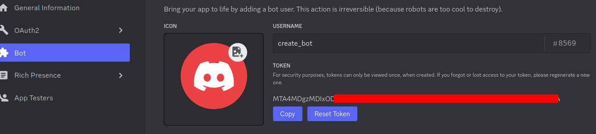
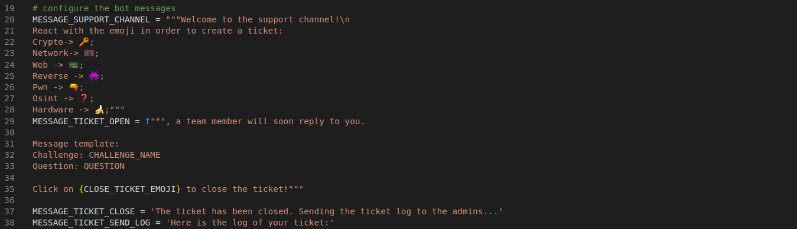

# CTF Discord Ticket Bot
This bot will help you manage tickets during CTF (Capture The Flag) events.

# 1. How does it work?
1\) The bot will send a message in the selected channel (in this case the channel is named "support" and it is placed under the "Support" category).  


2\) When the user reacts with the availble emojis, a private channel with him and the supporting team is created. The name of the channel is {category}+{nickname}.  
  


3\) When the user reacts with the "close ticket" emoji, the private channel will be removed and the ticket log is sent to the log channel and to the ticket owner (in this case the channel is named "log_channel").  
  


# 2. Install

## Configuration
### 1. Bot Creation
Create an application on https://discord.com/developers/. Add a new bot and give it a name. Generate a token and save it, you will need it later.  
  

Enable the Priviledge Gateway Intents (presence, server members, message content) on the same page. Give the bot the "Administrator" permission and save.  

Go to the "OAuth2" tab, tick the "bot" scope and the "Administrator" bot permission. You will get a link that will add the bot to your server (you need an admin account in order to do so).  
  

### 2. .env file
Create a file called ".env" with your bot token.  
```env
# .env
DISCORD_TOKEN='<TOKEN_SAVED_FROM_BEFORE>'
```

### 3. Configure the bot messages
Choose how many challenge categories you want. In this case there are 7 categories: crypto, web, network, reverse, binary, osint and hardware. Select one emoji for each category and edit them accordingly.  
IMPORTANT: you need to have different roles for each category. Every time that a ticket is created, it is assigned to the corresponding role. For example, if a 'crypto' ticket is created, it is assigned to the 'crypto' role and the people that belong to that role. In order to create roles go to "server settings", "roles", "create role".    
  

Select the category in which the support channel and the log channel will be placed (look at the first image of this file for clarification).  
  

Define the messages that will be sent in the support channel and the one that will be sent when a new ticket is created.  
  

## Dependencies
```bash
pip install discord.py
pip install python-dotenv
pip install regex
```

## Docker instance
You can directly deploy the bot using a docker instance. You can either use the Docker file or the docker-compose.yaml.  
```bash
# Dockerfile
docker build -t <name_image> .
docker run -d <name_image>

# docker-compose
docker-compose up
```